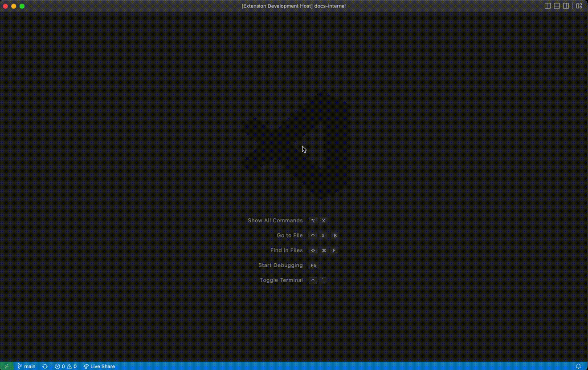

# ghdocs-goer

A VS Code Extension for people who contribute to https://github.com/github/docs
by editing Markdown files in VS Code.

With this extension you can quickly go from a currently open `.md` file
to the equivalent URL in production and your local preview server
on `localhost:4000`.

## Features

Describe specific features of your extension including screenshots of your extension in action. Image paths are relative to this README file.

For example if there is an image subfolder under your extension project workspace:

### Opening the current .md file in production

### Opening from a URL

## How to use it

When editing a `.md` file that is somewhere inside the `content` directory,
start the Command Palette (⇧⌘P) and type `goer: Open in production` (or
`goer: Open in localhost`) and hit Enter.

What you might notice is that the Command Palette supports fuzzy matching
so you don't need type it all. It might enough to just type some of the
words that are present. E.g. `gorlocah` from
"**go**e**r**: Open in **loca**l**h**ost".

<!-- > Tip: Many popular extensions utilize animations. This is an excellent way to show off your extension! We recommend short, focused animations that are easy to follow. -->

## Requirements

None that I know of.

## Extension Settings

None at the moment.

NB: It would be nice to be able to override the domains
(e.g. `127.0.0.1:4000`  instead of `localhost:4000`).

## Known Issues

It's very early days.

## Release Notes

### 2.0.2

Bug fix for when you're opening by URL and it contains something like
`enterprise-cloud@latest` in the URL which is a virtual thing.

### 2.0.1

Bug fix for when you're opening within a workspace but the *current*
open file isn't within a `content` directory.

### 2.0.0

Support for "Open from URL".

### 1.0.0

Basic testing release version.

<!-- ### 1.0.1

Fixed issue #.

### 1.1.0

Added features X, Y, and Z. -->

## Contributing

- Open this git repo in your VSCode, the press `F5` to open the debugger.

- This will open a new window that you can immediately use.

- When you edit any of the `.ts` files in the extension go over to
  the other opened window and run the command `Developer: Reload Window`
